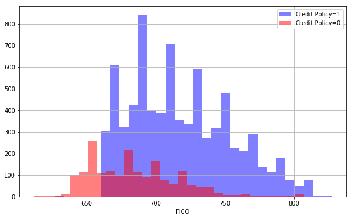
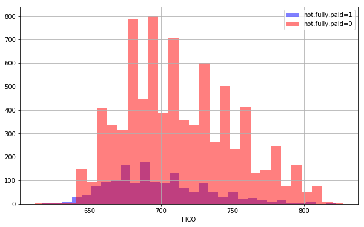
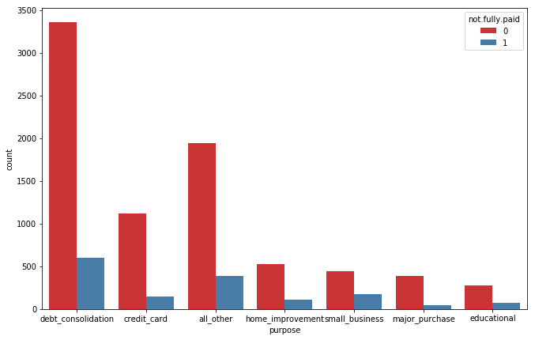
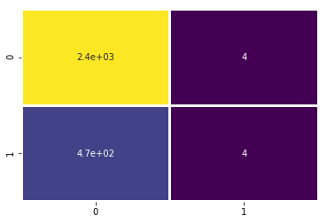
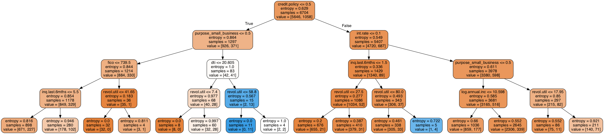

____

# Decision Trees - Classification.
____
This kernel follows a previous discussion on introduction to decision trees.

## Implimentation with Python.

For this project I will be exploring publicly available data from [LendingClub.com](www.lendingclub.com). Lending Club connects people who need money (borrowers) with people who have money (investors). Hopefully, as an investor you would want to invest in people who showed a profile of having a high probability of paying you back. I will try to create a model that will help predict this.


**Data Features:**

Target Variable.
_'not.fully.paid'_ 1 if customer fully paid and 0 if otherwise

Explanatory Variables.

* _credit.policy:_ 1 if the customer meets the credit underwriting criteria of LendingClub.com, and 0 otherwise.
* _purpose:_ The purpose of the loan (takes values "credit_card", "debt_consolidation", "educational", "major_purchase", "small_business", and "all_other").
* _int.rate:_ The interest rate of the loan, as a proportion (a rate of 11% would be stored as 0.11). Borrowers judged by LendingClub.com to be more risky are assigned higher interest rates.
* _installment:_ The monthly installments owed by the borrower if the loan is funded.
* _log.annual.inc:_ The natural log of the self-reported annual income of the borrower.
* _dti:_ The debt-to-income ratio of the borrower (amount of debt divided by annual income).
* _fico:_ The FICO credit score of the borrower.
* _days.with.cr.line:_ The number of days the borrower has had a credit line.
* _revol.bal:_ The borrower's revolving balance (amount unpaid at the end of the credit card billing cycle).
* _revol.util:_ The borrower's revolving line utilization rate (the amount of the credit line used relative to total credit available).
* _inq.last.6mths:_ The borrower's number of inquiries by creditors in the last 6 months.
* _delinq.2yrs:_ The number of times the borrower had been 30+ days past due on a payment in the past 2 years.
* _pub.rec:_ The borrower's number of derogatory public records (bankruptcy filings, tax liens, or judgments).

## Importing Libraries


```python
import pandas as pd
import matplotlib.pyplot as plt
import numpy as np
import seaborn as sns
```

## Data Ingestion


```python
loan_data = pd.read_csv("loan_data.csv")
```


```python
loan_data.info()
```

```python
loan_data.describe()
```

<table border="1" class="dataframe">
  <thead>
    <tr style="text-align: right;">
      <th></th>
      <th>credit.policy</th>
      <th>int.rate</th>
      <th>installment</th>
      <th>log.annual.inc</th>
      <th>dti</th>
      <th>fico</th>
      <th>days.with.cr.line</th>
      <th>revol.bal</th>
      <th>revol.util</th>
      <th>inq.last.6mths</th>
      <th>delinq.2yrs</th>
      <th>pub.rec</th>
      <th>not.fully.paid</th>
    </tr>
  </thead>
  <tbody>
    <tr>
      <th>count</th>
      <td>9578.000000</td>
      <td>9578.000000</td>
      <td>9578.000000</td>
      <td>9578.000000</td>
      <td>9578.000000</td>
      <td>9578.000000</td>
      <td>9578.000000</td>
      <td>9.578000e+03</td>
      <td>9578.000000</td>
      <td>9578.000000</td>
      <td>9578.000000</td>
      <td>9578.000000</td>
      <td>9578.000000</td>
    </tr>
    <tr>
      <th>mean</th>
      <td>0.804970</td>
      <td>0.122640</td>
      <td>319.089413</td>
      <td>10.932117</td>
      <td>12.606679</td>
      <td>710.846314</td>
      <td>4560.767197</td>
      <td>1.691396e+04</td>
      <td>46.799236</td>
      <td>1.577469</td>
      <td>0.163708</td>
      <td>0.062122</td>
      <td>0.160054</td>
    </tr>
    <tr>
      <th>std</th>
      <td>0.396245</td>
      <td>0.026847</td>
      <td>207.071301</td>
      <td>0.614813</td>
      <td>6.883970</td>
      <td>37.970537</td>
      <td>2496.930377</td>
      <td>3.375619e+04</td>
      <td>29.014417</td>
      <td>2.200245</td>
      <td>0.546215</td>
      <td>0.262126</td>
      <td>0.366676</td>
    </tr>
    <tr>
      <th>min</th>
      <td>0.000000</td>
      <td>0.060000</td>
      <td>15.670000</td>
      <td>7.547502</td>
      <td>0.000000</td>
      <td>612.000000</td>
      <td>178.958333</td>
      <td>0.000000e+00</td>
      <td>0.000000</td>
      <td>0.000000</td>
      <td>0.000000</td>
      <td>0.000000</td>
      <td>0.000000</td>
    </tr>
    <tr>
      <th>25%</th>
      <td>1.000000</td>
      <td>0.103900</td>
      <td>163.770000</td>
      <td>10.558414</td>
      <td>7.212500</td>
      <td>682.000000</td>
      <td>2820.000000</td>
      <td>3.187000e+03</td>
      <td>22.600000</td>
      <td>0.000000</td>
      <td>0.000000</td>
      <td>0.000000</td>
      <td>0.000000</td>
    </tr>
    <tr>
      <th>50%</th>
      <td>1.000000</td>
      <td>0.122100</td>
      <td>268.950000</td>
      <td>10.928884</td>
      <td>12.665000</td>
      <td>707.000000</td>
      <td>4139.958333</td>
      <td>8.596000e+03</td>
      <td>46.300000</td>
      <td>1.000000</td>
      <td>0.000000</td>
      <td>0.000000</td>
      <td>0.000000</td>
    </tr>
    <tr>
      <th>75%</th>
      <td>1.000000</td>
      <td>0.140700</td>
      <td>432.762500</td>
      <td>11.291293</td>
      <td>17.950000</td>
      <td>737.000000</td>
      <td>5730.000000</td>
      <td>1.824950e+04</td>
      <td>70.900000</td>
      <td>2.000000</td>
      <td>0.000000</td>
      <td>0.000000</td>
      <td>0.000000</td>
    </tr>
    <tr>
      <th>max</th>
      <td>1.000000</td>
      <td>0.216400</td>
      <td>940.140000</td>
      <td>14.528354</td>
      <td>29.960000</td>
      <td>827.000000</td>
      <td>17639.958330</td>
      <td>1.207359e+06</td>
      <td>119.000000</td>
      <td>33.000000</td>
      <td>13.000000</td>
      <td>5.000000</td>
      <td>1.000000</td>
    </tr>
  </tbody>
</table>
</div>


```python
loan_data.sample(5)
```
<table border="1" class="dataframe">
  <thead>
    <tr style="text-align: right;">
      <th></th>
      <th>credit.policy</th>
      <th>purpose</th>
      <th>int.rate</th>
      <th>installment</th>
      <th>log.annual.inc</th>
      <th>dti</th>
      <th>fico</th>
      <th>days.with.cr.line</th>
      <th>revol.bal</th>
      <th>revol.util</th>
      <th>inq.last.6mths</th>
      <th>delinq.2yrs</th>
      <th>pub.rec</th>
      <th>not.fully.paid</th>
    </tr>
  </thead>
  <tbody>
    <tr>
      <th>719</th>
      <td>1</td>
      <td>all_other</td>
      <td>0.1008</td>
      <td>387.66</td>
      <td>11.775290</td>
      <td>21.20</td>
      <td>772</td>
      <td>6750.041667</td>
      <td>74885</td>
      <td>0.0</td>
      <td>0</td>
      <td>0</td>
      <td>0</td>
      <td>0</td>
    </tr>
    <tr>
      <th>3200</th>
      <td>1</td>
      <td>debt_consolidation</td>
      <td>0.0768</td>
      <td>212.10</td>
      <td>10.548284</td>
      <td>22.98</td>
      <td>772</td>
      <td>3686.000000</td>
      <td>3041</td>
      <td>7.7</td>
      <td>3</td>
      <td>0</td>
      <td>0</td>
      <td>0</td>
    </tr>
    <tr>
      <th>4511</th>
      <td>1</td>
      <td>debt_consolidation</td>
      <td>0.0894</td>
      <td>95.32</td>
      <td>11.338060</td>
      <td>23.05</td>
      <td>717</td>
      <td>8339.958333</td>
      <td>14040</td>
      <td>67.2</td>
      <td>0</td>
      <td>0</td>
      <td>0</td>
      <td>0</td>
    </tr>
    <tr>
      <th>6153</th>
      <td>1</td>
      <td>home_improvement</td>
      <td>0.1253</td>
      <td>669.33</td>
      <td>12.043554</td>
      <td>3.43</td>
      <td>717</td>
      <td>4380.000000</td>
      <td>3670</td>
      <td>18.9</td>
      <td>0</td>
      <td>0</td>
      <td>0</td>
      <td>0</td>
    </tr>
    <tr>
      <th>2362</th>
      <td>1</td>
      <td>debt_consolidation</td>
      <td>0.1821</td>
      <td>290.07</td>
      <td>10.555188</td>
      <td>10.76</td>
      <td>672</td>
      <td>1980.041667</td>
      <td>9961</td>
      <td>99.6</td>
      <td>0</td>
      <td>0</td>
      <td>0</td>
      <td>0</td>
    </tr>
  </tbody>
</table>
</div>


## Exploratory Data Analysis.
This is a brief EDA because the project aims at Decision tree Ilustration.


```python
plt.figure(figsize=(10,6))
loan_data[loan_data['credit.policy']==1]['fico'].hist(alpha=0.5,color='blue',
                                              bins=30,label='Credit.Policy=1')
loan_data[loan_data['credit.policy']==0]['fico'].hist(alpha=0.5,color='red',
                                              bins=30,label='Credit.Policy=0')
plt.legend()
plt.xlabel('FICO')
```
Text(0.5, 0, 'FICO')





```python
plt.figure(figsize=(10,6))
loan_data[loan_data['not.fully.paid']==1]['fico'].hist(alpha=0.5,color='blue',
                                              bins=30,label='not.fully.paid=1')
loan_data[loan_data['not.fully.paid']==0]['fico'].hist(alpha=0.5,color='red',
                                              bins=30,label='not.fully.paid=0')
plt.legend()
plt.xlabel('FICO')
```
Text(0.5, 0, 'FICO')


```python
plt.figure(figsize=(11,7))
sns.countplot(x='purpose',hue='not.fully.paid',data=loan_data,palette='Set1')
```



## Setting Up the Data.

My data here has some categorical variables which i have to tame because the model algorithm may not work well with such data if not formated correctly.


```python
categorical_var = ['purpose']
```


```python
loan_data2 = pd.get_dummies(data= loan_data,columns=categorical_var,drop_first=True)
loan_data2.columns
```
    Index(['credit.policy', 'int.rate', 'installment', 'log.annual.inc', 'dti',
           'fico', 'days.with.cr.line', 'revol.bal', 'revol.util',
           'inq.last.6mths', 'delinq.2yrs', 'pub.rec', 'not.fully.paid',
           'purpose_credit_card', 'purpose_debt_consolidation',
           'purpose_educational', 'purpose_home_improvement',
           'purpose_major_purchase', 'purpose_small_business'],
          dtype='object')
## Train test Split


```python
from  sklearn.model_selection import train_test_split
```
```python
X = loan_data2.drop('not.fully.paid',axis = 1)
```
```python
y = loan_data2['not.fully.paid']
```


```python
X_trainset, X_testset, y_trainset, y_testset = train_test_split(X, y, test_size=0.30, random_state=2)
```

## Training A decision tree model


```python
from sklearn.tree import DecisionTreeClassifier
```
```python
loanTree = DecisionTreeClassifier(criterion="entropy", max_depth = 4)
loanTree
```
    DecisionTreeClassifier(class_weight=None, criterion='entropy', max_depth=4,
                max_features=None, max_leaf_nodes=None,
                min_impurity_decrease=0.0, min_impurity_split=None,
                min_samples_leaf=1, min_samples_split=2,
                min_weight_fraction_leaf=0.0, presort=False, random_state=None,
                splitter='best')
```python
loanTree.fit(X_trainset,y_trainset)
```
    DecisionTreeClassifier(class_weight=None, criterion='entropy', max_depth=4,
                max_features=None, max_leaf_nodes=None,
                min_impurity_decrease=0.0, min_impurity_split=None,
                min_samples_leaf=1, min_samples_split=2,
                min_weight_fraction_leaf=0.0, presort=False, random_state=None,
                splitter='best')
## Model Evaluation


```python
predLoan = loanTree.predict(X_testset)
```
```python
from sklearn.metrics import confusion_matrix,classification_report,precision_score
```
```python
print(classification_report(y_testset,predLoan))
```

                  precision    recall  f1-score   support
    
               0       0.84      1.00      0.91      2399
               1       0.50      0.01      0.02       475
    
       micro avg       0.83      0.83      0.83      2874
       macro avg       0.67      0.50      0.46      2874
    weighted avg       0.78      0.83      0.76      2874
    


This produces a 78% accuracy level


```python
sns.heatmap(confusion_matrix(y_testset,predLoan),cmap="viridis",lw = 2,annot=True,cbar=False)
```


    <matplotlib.axes._subplots.AxesSubplot at 0x1a1c9fea58>





The decision tree model produces a 78% accuracy which is impressive given that no feature engeneering has been done or even parameter tuning to improve the model.

The precission can be improved also later by applying random forest clasifier algorithm which is better than Simple decision tree as this one.More on that on another kernel.

## Visualization of the decision tree


```python
from IPython.display import Image  
from sklearn.externals.six import StringIO  
from sklearn.tree import export_graphviz
import pydot

features = list(X.columns)
# features
```


```python
dot_data = StringIO()  
export_graphviz(loanTree, out_file=dot_data,feature_names=features,filled=True,rounded=True)

graph = pydot.graph_from_dot_data(dot_data.getvalue())  
Image(graph[0].create_png())
```





____

# THE END

____
